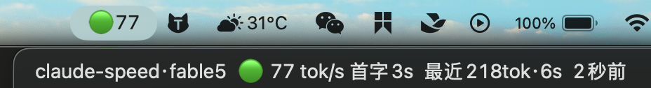

# claude-speed


> 基于 [JuDaXia/claude-speed](https://github.com/JuDaXia/claude-speed) 的分支，新增 **Windows 托盘应用**、**WSL 支持**（Windows 托盘可合并 WSL 里的会话）与既有状态栏脚本的**嵌入模式**。测速算法与 METRIC 标准未改动。

**看见编码代理的真实生成速度。** macOS 菜单栏应用 / Windows 托盘应用 + Claude Code 终端 statusline，把每次回复的**真·生成速度（tok/s）**和**首字延迟（TTFT）**拆开显示——后者才是真正在波动的东西。

[English docs →](README.md)

> 非官方社区工具，与 Anthropic 无关。



请求等待期间，下拉里的 `⏳等8秒` 会实时上涨——标题本身保持最简。

```
statusline:  Fable 5 | ⚡71 tok/s 首字4.2s | 最近1022tok·22s | ctx 70%
```

## 为什么做这个

用 Claude Code 常觉得「忽快忽慢」，其中大部分是**测量假象**：

- 每次 API 响应都有一笔**固定的首字开销（TTFT，通常 5–7 秒）**：排队、prompt 预填充、缓存查找；
- 朴素算法 `输出token ÷ 总耗时` 因此**在短回复上塌方**：真速 60 tok/s、TTFT 5s 时，300 token 的回复显示 30 tok/s（虚低一半），3000 token 的回复显示 55——同一台服务器、同一秒。

claude-speed 对近期响应拟合 `耗时 ≈ TTFT + token数/TPS`（Theil-Sen 回归，对离群稳健），把两个数分开报告：

- **TPS（斜率）**——模型真实生成速度。很稳。这是主指标；
- **TTFT（截距）**——首字延迟。真正在抖的量（缓存未命中/上下文太长/服务端高峰），也是本工具报警的对象。

## 组件

| 文件 | 作用 |
|---|---|
| `collect.py` | 采集核心：扫描 Claude Code、Codex CLI、Kimi Code 与 OpenCode 的活跃会话，输出「首行=菜单栏标题，其余行=下拉明细」 |
| `main.swift` → `ClaudeSpeed` | macOS 菜单栏应用（零第三方依赖，`swiftc` 直编），每 3s 刷新 |
| `ClaudeSpeed.ps1` + `install.ps1` | Windows 托盘应用（纯 PowerShell / WinForms，零依赖），同样 3s 刷新；可经 `wsl.exe` 合并 WSL 里的会话 |
| `statusline-speed.py` | [Claude Code statusline](https://docs.anthropic.com/en/docs/claude-code/statusline) 脚本——同一套算法，渲染成输入框下方一行 ANSI 彩色文本 |

覆盖所有 Claude Code 客户端（CLI、桌面 App、VS Code 插件都写同一份 transcript）；菜单栏合并 **Claude Code、Codex CLI、Kimi Code 与 OpenCode Desktop/CLI** 四类会话（见「测速算法」）。OpenCode 没有 statusline 接线，`--statusline` 仍只服务 Claude Code。所有数据都在本地只读，无任何网络请求。

## 安装

**菜单栏应用（macOS）：**

```bash
git clone https://github.com/JuDaXia/claude-speed && cd claude-speed
./install.sh                # 只装菜单栏
./install.sh --statusline   # 顺带接线 Claude Code statusline
```

需要 Xcode Command Line Tools（`xcode-select --install`）和 python3。

**装完立刻能看到什么：菜单栏出现 `⚪` 图标**（闲置——还没有活跃会话）。随便开个 Claude Code 或 OpenCode Desktop 会话问点东西，几秒后变成 `🟢71` 这样的实时读数；带 `--statusline` 装的话，速度行会在 Claude Code 输入框下方随下次刷新出现——无需重启。如果什么都没出现，跑 `./collect.py`：它打印的就是菜单栏该显示的内容，排障入口。

注意：
- LaunchAgent 指向 clone 目录——clone 到哪都行，但之后**挪了目录要重跑 `install.sh`**；
- 如果 OpenCode 使用自定义 `XDG_DATA_HOME` 或 `OPENCODE_DB`，`install.sh` 会把当前值写入 LaunchAgent；变量改变后需重跑安装；
- `--statusline` 修改 `~/.claude/settings.json` 前会自动备份成 `.bak`；
- **更新**：`git pull && ./install.sh`（幂等——重编译并重启）。

**Windows（托盘应用）：** 在 PowerShell（5.1 或 7）里，需要 PATH 上有 python 3：

```powershell
git clone https://github.com/szxypi/claude-speed; cd claude-speed
.\install.ps1                 # 托盘 + 开机自启快捷方式（shell:startup）
.\install.ps1 -Statusline     # 顺带接线 Claude Code statusline
```

托盘出现一个带 tok/s 数字的彩色圆点（`⚪` 为闲置）。悬停看摘要，点击看每会话一行。`-Python <exe>` 指定解释器，`-NoAutostart` 不建自启快捷方式，`.\uninstall.ps1` 全部卸掉。

**Windows + WSL（一个托盘看两边）：** 托盘无法直接读 WSL 的 transcript（`\\wsl$` 走 9P 很慢，部分内核上直接不可用），所以让 WSL 里的副本自己采集、托盘合并结果：

```powershell
# WSL 里也 clone 一份（如 ~/projects/claude-speed），然后：
.\install.ps1 -Remotes 'wsl.exe -e python3 /home/<你>/projects/claude-speed/collect.py --json'
```

`-Remotes` 写入用户环境变量 `CLAUDE_SPEED_REMOTES`（`;` 分隔多条命令）。每条命令须输出 `collect.py --json`；远端行显示为 `wsl:项目·模型`。远端会话的斜率池独立（不跨主机借斜率）。远端失败或超过 8 秒会被静默跳过。

**WSL / Linux（只有 statusline——WSLg 没有可靠的托盘）：**

```bash
git clone https://github.com/szxypi/claude-speed ~/projects/claude-speed
~/projects/claude-speed/install.sh --statusline   # 替换 ~/.claude/settings.json 的 statusLine（备份 .bak）
```

**嵌入到你已有的状态栏脚本**（保留自己的排版；macOS/Linux/WSL/Windows git-bash 通用）：

```bash
# 在你的 statusline 脚本里，$input 是 Claude Code 喂进来的 JSON
case "$OSTYPE" in msys*|cygwin*) py=python ;; *) py=python3 ;; esac   # Windows 的 python3 是商店占位 stub
seg=$(printf '%s' "$input" | CLAUDE_SPEED_SEP=" | " "$py" ~/projects/claude-speed/statusline-speed.py --segment)
[ -n "$seg" ] && line+=" | $seg"
```

`--segment` 只输出速度片段（`⚡71 tok/s 首字4.2s | 缓存98% | 最近1022tok·22s | 🤖2 Σ40tok/s | ⚠️1错`）——不含模型名与 ctx%，**没有数据时什么都不输出**，宿主行不会出现空槽位。`CLAUDE_SPEED_SEP` 可覆盖分隔符。

**只用 statusline（任何平台，含 Linux）：** 在 `~/.claude/settings.json` 加：

```json
{ "statusLine": { "type": "command", "command": "/path/to/claude-speed/statusline-speed.py", "padding": 0 } }
```

**卸载：** macOS/Linux 用 `./uninstall.sh`（移除 LaunchAgent 和 statusline 接线），Windows 用 `.\uninstall.ps1`（托盘、自启快捷方式、statusline 接线、`CLAUDE_SPEED_REMOTES`）。

## 显示语义速查

菜单栏标题 = `[⚠️][速度灯][ 🤖N]`，例 `⚠️🟢71 🤖3`：

| 符号 | 含义 |
|---|---|
| 🟢 / 🟡 / 🔴 | 纯生成速度 ≥50 / ≥30 / <30 tok/s |
| `≈70` | 斜率借自同模型其他会话（两阶段拟合——新会话样本还少） |
| `≥50` | 下界估计（样本不足以拆 TTFT，真值只会更高） |
| `⚪` | 闲置（10 分钟无响应）或速度不确定 |
| `⚠️` | 近 5 分钟内有 API 错误 |
| `🤖3` | 3 个后台子代理正在运行（Task/调研类任务） |
| `🤖3 Σ140` | 纯后台模式：前台无读数，舰队合计正以 140 tok/s 产出 |

标题刻意保持最简——等待类指示只进下拉：`⏳等N秒` 在请求等待期间实时上涨（>120s 视为已中断自动消失），还没有任何响应的会话显示「等待首个响应」。

下拉每行一个活跃会话（最多 4 个，近 2 小时，**Claude Code、Codex CLI、Kimi Code 与 OpenCode 合并排序**）：

```
myproject·fable5  🟢 71 tok/s 首字4s  缓存12%冷  ⚠️1错  最近1022tok·22s  4秒前
```

`首字Ns`=首字延迟 · `·近N分`=扩窗后的拟合口径（≤10 分钟不标）· `🤖N·Σtok/s`=活跃后台子代理数及其合计燃烧率 · `缓存N%`=最后一条响应的缓存命中率（偏低可解释首字尖峰；`冷`=缓存写入多于读取）· `⚠️N错`=近 30 分钟错误数 · `最近Ntok·Ns`=最后一条响应的规模；全错会话显示 `🔴 无成功响应`；等待中的会话按有无历史响应显示「等待首个响应/等待响应」。

statusline 颜色：速度 绿≥50/黄≥30/红<30 · 首字 绿≤5s/黄≤12s/红>12s · ctx 黄≥60%/红≥85%。

## 测速算法

- transcript JSONL 里同一 `message.id` 的连续 assistant 记录 = 一次 API 响应。耗时 = 组内最后时间戳 − 组前一条记录时间戳（≈请求发出时刻），**含 TTFT**；token 数取组内 `usage.output_tokens` 最大值（同组 usage 重复）；
- API 错误合成消息（`message.model == '<synthetic>'`）不成组，但时间戳仍当下一组锚点（报错重试从错误时刻起算更准），并计入 ⚠️ 指示；
- **分模型拟合**：只用当前模型的组——会话中途切模型混拟会失真；
- **剔离群**：`耗时/token > 0.5s` 的组掺了「用户打字停顿」，剔除；
- **滑动窗口**：优先用近 10 分钟样本（服务端负载随时段漂移），拆不出则窗口倍增，扩窗标 `·近N分`；
- **两阶段拟合**：单会话样本不足时，斜率（模型属性）借同模型跨会话点池，截距（会话属性）本地拟合——新会话约 2 条响应就能出速度（标 `≈`）；
- **诚实回退**：再不行时，长回复（≥300tok）的 blended 速度按**下界** `≥N` 显示（下界过绿线才亮绿灯）；否则「速度样本不足」。大文件只尾读 400KB，坏行静默跳过；
- **后台子代理监控**：调研/Task 类后台任务写在 `<会话>/subagents/agent-*.jsonl`，主 transcript 期间静默——因此会话活跃时间取 `max(主transcript, 最新子代理)`，后台干活不会被误判成闲置。近 90 秒有写入的代理算活跃，其近 2 分钟合计产出即舰队燃烧率（`🤖N Σtok/s`），代理的响应样本同时并入跨会话点池参与两阶段拟合；
- **Codex CLI 支持**（仅菜单栏）：Codex 会话在 `~/.codex/sessions/YYYY/MM/DD/rollout-*.jsonl`，每次 API 响应流式写内容记录、以带完整 usage 的 `token_count` 事件收尾。组 start = 首条内容记录的前一条记录时间戳（含 TTFT，与 Claude 语义一致）；组 end = **最后一条内容记录**而非 `token_count`——后者在工具执行完才发出，会把工具耗时算进生成时间。模型取 `turn_context`、项目标签取 `session_meta.cwd`、缓存命中率 = `cached_input_tokens/input_tokens`。下游拟合/滑窗/显示全部复用。文件被碰过但内容陈旧的僵尸会话不入榜。
- **Kimi Code 支持**（仅菜单栏——Kimi Code 没有 statusline 机制）：会话在 `~/.kimi-code/sessions/<workDirKey>/<sessionId>/agents/main/wire.jsonl`（数据根可用 `KIMI_CODE_HOME` 重定位）。一次 API 响应 = `llm.request` 记录与其收尾的 `step.end` 事件配对（后者带完整 usage）。组 start = `llm.request` 的 time（它本身就是请求发出时刻）；组 end = `step.end` 的 time；wire 的 `time` 字段是 epoch 毫秒字符串。重试（`step.end` 前出现新的 `llm.request`）锚点取重试时刻，与 Claude 的错误锚点规则一致。usage 一一对应（`inputOther`/`inputCacheRead`/`inputCacheCreation`）；模型取 `llm.request.model`；项目标签取 `session_index.jsonl` 的 `workDir`，缺失时回退 `workDirKey` 的 slug 段。子代理在 `agents/agent-*/wire.jsonl`，同样计入舰队监控（`🤖N Σtok/s`）与斜率点池。注意：`wire.jsonl` 是未文档化的内部格式——解析器对不认识的记录一律跳过，未来格式变化只会让显示降级而不会崩溃。
- **OpenCode Desktop 支持**（仅菜单栏——没有 statusline 接线）：OpenCode v1.18.15 的 Desktop 与 CLI 共用 XDG data 数据库 `$XDG_DATA_HOME/opencode/opencode.db`（macOS 默认 `~/.local/share/opencode/opencode.db`）；claude-speed 只读 SQLite 及其 WAL，不写入任何内容。每条已完成的 assistant message = 一次响应，`out = tokens.output + tokens.reasoning`。生成边界取最后一个 text/reasoning 的结束时间或 tool 的开始时间（旧格式缺字段时才回退 `time.completed`）；耗时从 `time.created` 算到该边界，再扣除边界前 tool state 时间区间的**并集**。这样重叠工具只扣一次，本地 `bash`/`task`/`question` 执行也不会污染生成速度。输入与缓存 usage 分别映射 `tokens.input`、`tokens.cache.read`、`tokens.cache.write`；模型键取 `providerID/modelID`，项目标签取 `session.directory`。带 `parent_id` 的子会话视作后台代理，同样进入舰队监控和跨会话斜率点池。数据库与 schema 都是未文档化的内部实现；遇到不认识的 schema 会静默跳过，只让显示降级，不让采集器崩溃。

## 运维

```bash
# 改 main.swift 后重编译
swiftc -O -o ClaudeSpeed main.swift

# 重启菜单栏应用——必须用 kickstart，不要用 unload/load：
# 在非 GUI 上下文（SSH/后台 shell/自动化代理）执行 unload/load 会把应用启动在
# 无 WindowServer 连接的环境：进程活着但图标不显示、定时器不跑。
launchctl kickstart -k gui/$(id -u)/com.claude-speed.menubar

# 手动测采集
./collect.py               # 合并视图（含 CLAUDE_SPEED_REMOTES）
./collect.py --no-remote   # 只看本机
./collect.py --json        # 远端交给托盘的原始行

# Windows：重启托盘（install.ps1 幂等，做的就是这件事）
.\install.ps1 -NoAutostart
```

阈值、窗口、会话数等可调参数都是两个 Python 脚本顶部的常量。

## 测量标准

显示的速度是**估计值**、非绝对读数,其基准会随算法演进而漂移——所以定义被钉死。
[METRIC.md](METRIC.md) 是带版本号的规范(当前 v1.2):速度的定义、锚点规则、估计器、
全部参数。`tests/fixtures/*.jsonl` 是冻结的数据源记录(千克原器),`tests/golden.json`
是它们的认证读数。每次 CI 都断言估计器仍能复现这些读数(**漂移**——任何移动了数字的
代码改动都会让测试变红),并且仍能还原每个合成夹具的已知真值(**校准**——拦截有偏的重定标)。
改基准是刻意行为:跑 `regen_golden.py`、review `golden.json` 的 diff、升版本号、写明漂移幅度。

## 开发

```bash
python3 -m unittest discover -s tests -v
```

测试覆盖:拟合数学(已知真值还原、离群剔除、扩窗)、数据源适配(含 OpenCode
SQLite/WAL 解析与工具耗时扣除)、菜单栏端到端场景(等待/错误/冷缓存/两阶段拟合/
后台子代理与燃烧率折算)、以及一个 AST 级源码比对——强制共享算法在 `collect.py`
与 `statusline-speed.py` 间保持逐字一致。CI 在 macOS + Linux + Windows 跑测试,外加
`swiftc` 编译冒烟。

## License

[MIT](LICENSE)
